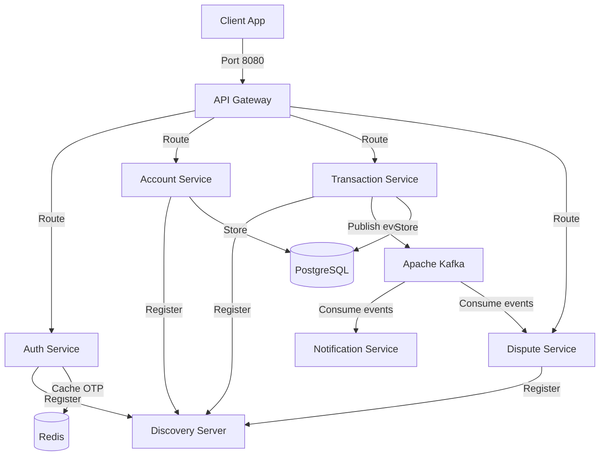

# Prymo SecureHold Backend Microservices

Welcome to the backend architecture for **Prymo**, a modern digital banking platform offering secure escrow transactions via **SecureHold Protection** for users in Nigeria and across Africa.

This repository is built using a Java Spring Boot microservice architecture, orchestrated with Spring Cloud, and integrated with databases and message queues for real-time operation.

---

## 🚀 Architecture Overview



---

## 🛠️ Technology Stack

- **Java 17** & **Spring Boot 3.2.2**
- **Spring Cloud 2023.0.0** (Eureka Server, API Gateway)
- **Apache Kafka** (Asynchronous event-driven communication between services)
- **Redis** (In-memory caching for OTP codes and session tokens)
- **PostgreSQL** (Relational storage for linked bank accounts, profiles, transactions, and disputes)
- **Keycloak** (Identity and Access Management / OAuth2)
- **Lombok** (Boilerplate code reduction)
- **Maven** (Multi-module project build tool)

---

## 🎛️ Port Configuration & Microservices Map

| Service Name | Port | Description |
| :--- | :--- | :--- |
| **`discovery-server`** | `8761` | Eureka Discovery Server for service registration & lookup |
| **`api-gateway`** | `8080` | Spring Cloud Gateway for centralized routing, CORS, and request forwarding |
| **`auth-service`** | `8081` | Handles registration, sign-in, and phone/email OTP verification codes |
| **`account-service`** | `8082` | Manages user profiles, linking bank accounts (Paystack API), and ledger |
| **`transaction-service`** | `8083` | Handles funds transfers, escrow creation, and release of SecureHold funds |
| **`dispute-service`** | `8084` | Orchestrates disputes on escrow locks, resolving conflicts via support |
| **`notification-service`** | `8085` | Consumes Kafka events to send SMS (Vonage/Twilio) and Email alerts |

---

## 🛠️ Infrastructure Services (Docker Compose)

The project includes a `docker-compose.yml` to spin up local development containers for all required datastores and message brokers.

- **PostgreSQL**: `localhost:5432` (User: `postgres`, Password: `postgres`)
- **Redis**: `localhost:6379`
- **Apache Kafka / Zookeeper**: `localhost:9092`
- **Keycloak**: `localhost:7080`

---

## 🏃 Running Locally

### Step 1: Start Docker Infrastructure
From the root of the `backend` folder, run:
```bash
docker-compose up -d
```
Verify that all 5 containers (Postgres, Redis, Zookeeper, Kafka, Keycloak) are running.

### Step 2: Build the Parent Maven Project
Compile all microservices and generate dependencies:
```bash
mvn clean install
```

### Step 3: Run the Services in Order
Start the services in the following order to allow proper registration and routing:

1. **Start Discovery Server**:
   ```bash
   cd discovery-server
   mvn spring-boot:run
   ```
   *Verify Eureka is live at [http://localhost:8761](http://localhost:8761)*

2. **Start API Gateway**:
   ```bash
   cd ../api-gateway
   mvn spring-boot:run
   ```

3. **Start Core Services (Open separate terminals)**:
   Navigate to each microservice folder (`auth-service`, `account-service`, `transaction-service`, `dispute-service`, `notification-service`) and run:
   ```bash
   mvn spring-boot:run
   ```

---

## 🛡️ SecureHold Flow
1. **Initiation**: A sender initiates a transfer with `holdDuration` (in hours) via `/api/v1/securehold/create`.
2. **Escrow Lock**: Funds are deducted from the sender and locked in a virtual escrow ledger under `SecureHold Balance` inside `account-service`.
3. **Completion**: Once the recipient delivers the service/goods, the sender/system triggers `/api/v1/securehold/{id}/release` to release the funds.
4. **Dispute**: In case of conflict, a dispute is logged at `/api/v1/securehold/{id}/dispute` which locks the funds until dispute resolution.
